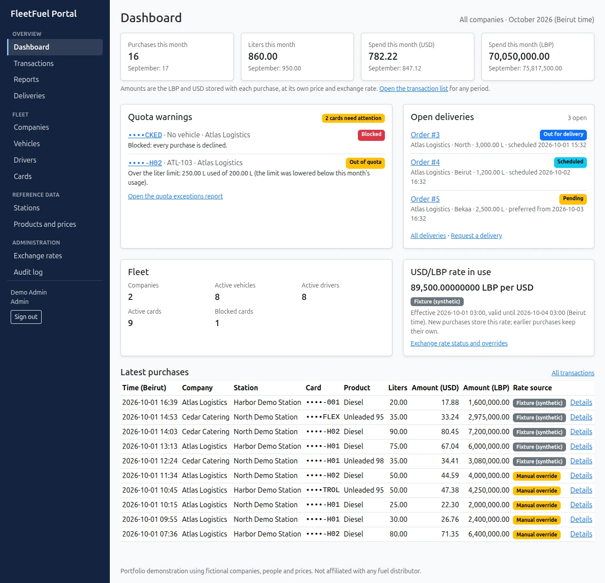
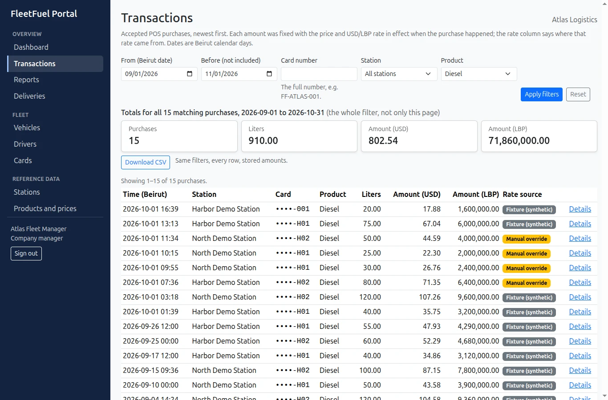
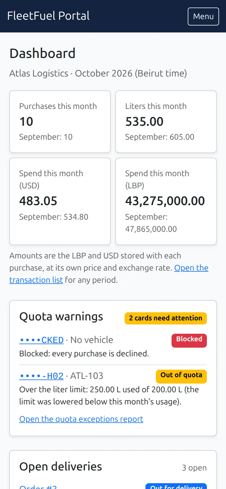
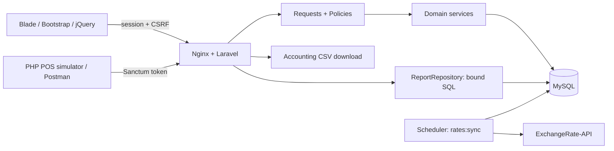

# FleetFuel Portal

[](https://github.com/WassimBannout/FleetFuel-Portal/actions/workflows/ci.yml)

A Laravel and MySQL web application for a fictional fuel distributor:
- companies run fleets on fuel cards with monthly quotas;
- station point-of-sale terminals report purchases through an idempotent API;
- managers order diesel deliveries;
- every amount is kept in Lebanese pounds and US dollars, with the exchange rate stored at purchase time.

This is a portfolio project. All companies, people, prices and rates are fictional, and nothing here describes a real company's systems.

| | Status |
| --- | --- |
| Application | Built in milestones M00–M11 and verified on MySQL 8.4: 593 automated PHP tests and 14 JavaScript tests, run by GitHub Actions on every push ([release verification](docs/RELEASE-VERIFICATION.md)) |
| Production | A production image, a [runbook](docs/RUNBOOK.md) with backup and restore, and a local deployment rehearsal that CI also runs |
| Live demo | **Not deployed yet.** The hosting, the domain and which demo accounts reviewers get are the owner's decision |
| Station terminals | Simulated: a separate PHP program plays the POS over HTTP |
| SQL Server | Not attempted (an optional stretch goal) |
| License | [MIT](LICENSE) |

| Dashboard (admin) | Transactions (manager) | Phone |
| --- | --- | --- |
|  |  |  |

Real screenshots from Chrome on freshly seeded demo data; more, with how they were taken, in [docs/screenshots](docs/screenshots/README.md).

## What it does

Three roles, each limited to its own data:

- **Distributor admin:**
  - companies, stations and products;
  - the LBP price timeline;
  - the USD/LBP rate (a daily sync, plus audited manual overrides);
  - every company's fleet, deliveries and reports, and the audit log.
- **Company manager**, for their own company only:
  - vehicles, drivers and fuel cards (monthly liter and USD limits, block and unblock);
  - purchases and diesel delivery requests;
  - reports and the accounting CSV.
- **Station operator:** their own station's purchases. Their POS terminal submits purchases with an API token.

The parts that carry the weight:

- **POS purchases** that cannot overspend a quota, even when several stations charge one card at the same moment, and that are recorded once however often a terminal retries.
- **Historical snapshots:** each purchase stores the price, exchange rate, amounts and ownership as they were, so later changes never reprice the past. Without a valid exchange rate, purchases are refused rather than converted at a guessed rate.
- **Diesel deliveries**, with an audited status timeline that two simultaneous clicks cannot corrupt.
- **SQL reports:** consumption, top stations, quota exceptions, anomalies, fuel efficiency and delivery times. Plus a streamed, formula-safe accounting CSV whose totals match the screen.
- **A responsive Bootstrap interface:**
  - a role-scoped dashboard;
  - a transaction list that filters without reloading the page;
  - an admin audit log;
  - a keyboard-usable layout.
- **An OpenAPI 3.1 contract** that the tests check against the real responses.

## Architecture

Laravel 13 on PHP 8.3 and MySQL 8.4, with Blade, Bootstrap 5 and jQuery built by Vite. Fortify handles browser sessions and Sanctum handles API tokens; `brick/math` does every amount calculation. Docker Compose runs everything locally.



- **Thin controllers.** Form Requests validate, Policies authorize, and services hold the write rules that the screens and the API share (`FuelTransactionService`, `FuelCardService`, `DeliveryOrderService`, …).
- **Every query is scoped first.** Each starts from the signed-in user's company or station before any lookup: route parameters, dropdowns, AJAX, reports and exports. Another company's record is simply "not found".
- **`ReportRepository`** holds the reporting SQL, with bound values and allowlisted groupings.
- **Data model:** tables, relations and constraints are in the [data model](docs/03-DATA-MODEL.md), with an ER diagram that a test compares with MySQL's real foreign keys.

## Quick start

You need Docker with Compose v2 and GNU Make. PHP 8.3, Composer, MySQL 8.4 and Node run in containers; nothing else is installed on the host.

```bash
make setup   # first run, and safe to repeat: keeps .env, APP_KEY and database data
```

Then open <http://localhost:8080>. Readiness (app + database) is at `/health`; liveness (app boots) is at `/up`.

| Command | What it does |
| --- | --- |
| `make setup` | Create `.env`/`.env.testing` only if absent (with generated local DB passwords), build the PHP image, install locked dependencies, create keys only if missing, migrate, seed an empty database, build assets, start the stack |
| `make up` / `make down` | Start or stop the stack; `down` keeps the MySQL volume |
| `make test` | PHPUnit against the separate `fleetfuel_test` MySQL database, plus the concurrency suite on `fleetfuel_test_concurrency` (overlapping PHP processes) and the simulator suite on `fleetfuel_test_integration` (the app over real HTTP); then the JavaScript unit tests (`npm test`, Node's built-in runner) |
| `make lint` / `make analyse` | Pint style check / Larastan (PHPStan level 6), then PHPStan level 6 for the POS simulator |
| `make build` | `npm ci` and a production Vite build |
| `make verify` | lint, analyse, test and build; stops at the first failure |
| `make audit` | Check the locked Composer and npm dependencies against published security advisories (needs the network; CI runs it too) |
| `make prod-image` / `make rehearse` | Build the production image / deploy it locally with disposable data, test it end to end, then remove it ([runbook](docs/RUNBOOK.md)) |
| `make simulate` | Run the POS simulator against the running stack (`SCENARIO=all`, `success`, `replay`, `conflict`, `blocked` or `quota`); credentials from `POS_*` environment variables, see [tools/pos-simulator](tools/pos-simulator/README.md) |
| `make logs` / `make shell` | Recent service logs / a shell in the app container |

To run other Artisan commands: `docker compose exec app php artisan <command>`.

### A second copy on one machine

Containers, the database volume and the PHP image are named after the Compose project, `fleetfuel` by default. A second clone of the repository on the same machine needs its own project name and port, set for its first setup:

```bash
COMPOSE_PROJECT_NAME=fleetfuel-copy APP_PORT=8081 make setup   # then open http://localhost:8081
```

Clone it under your home directory: Docker Desktop shares only some host folders with its containers (by default your home, not `/tmp`), and a copy elsewhere fails with "mounts denied". `make setup` writes both values into the new copy's `.env`, so later commands keep using them. Without them, `make setup`, `make up` and `make test` stop with an explanation instead of taking over the first copy's containers and database. The optional Mailpit container always uses port 8025, so run it in one copy at a time.

## Demo data

`make setup` seeds fictional demo data once, into an empty local database. If any user already exists it skips, so repeated setups never duplicate or overwrite data. All demo accounts share one local password, the `DEMO_PASSWORD` value in `.env` (`grep DEMO_PASSWORD .env`). `make setup` generates it when it creates `.env`, and it is stored hashed. Sign in at <http://localhost:8080/login>: admins and managers land on the dashboard, operators on their station page.

| Role | Email | Scope |
| --- | --- | --- |
| Admin | admin@fleetfuel.test | Distributor |
| Company manager | manager.atlas@fleetfuel.test | Atlas Logistics |
| Company manager | manager.cedar@fleetfuel.test | Cedar Catering |
| Station operator | operator.beirut@fleetfuel.test | Harbor Demo Station |
| Station operator | operator.tripoli@fleetfuel.test | North Demo Station |

Dates are relative to an "as of" clock (default: now). The POS simulator cards `FF-ATLAS-001`, `FF-ATLAS-BLOCKED`, `FF-ATLAS-TINY` and `FF-CEDAR-001` start with no usage; `docker compose exec app php artisan demo:simulator-cards` adds a fresh set for another simulator or Postman run without touching other data. Dashboard history (32 purchases over the current and previous month) lives on the other cards. It includes:

- a tank overfill;
- two fills 20 minutes apart;
- a card whose quota was cut below its usage;
- an expired provider exchange rate;
- an expired admin rate override;
- six deliveries covering every status.

- Seed with a chosen clock (empty database only): `docker compose exec app php artisan demo:seed --as-of=2026-09-28T09:00:00Z`
- Seeding refuses to run without `DEMO_MODE=true` or a `DEMO_PASSWORD`, and outside the `local`/`testing` environment. The one exception is a dedicated production demo deployment, which uses `php artisan demo:seed --force` on its empty database ([runbook](docs/RUNBOOK.md)).
- Starting over **deletes all local data**: `docker compose exec app php artisan migrate:fresh --seed`. It is deliberately not part of any `make` target.

## Using the application

### Dashboard, transactions and audit log

- **Dashboard** (admins and managers): this Beirut month's purchases, liters and spend next to last month's; quota warnings (blocked cards and cards out of quota, with the reason); open deliveries; the USD/LBP rate in use and where it came from (fixture, provider or manual override); the latest purchases. A manager sees their own company only.
- **Transactions** (every role, scoped: every purchase for admins, the own company for managers, the own station for operators): filter by Beirut dates, full card number, station, product and, for admins, company.
  - The totals cover the whole filter, not just the page, and **Download CSV** exports exactly those rows (admins and managers).
  - With JavaScript, a filter change reloads only the results and keeps the filters in the address bar, so reload, back/forward and shared links show the same view. An older, slower answer never overwrites a newer one. Without JavaScript the form still works.
  - While loading, the old results are dimmed; after an error they are replaced by the reason, with **Try again** or **Sign in again**.
- **Audit log** (admins): who changed what and when, filtered by person, action, record type, company and date. Fields named like credentials are never shown and card numbers are masked.
- Every page except the plain error pages has a "Skip to main content" link. Fields are labelled, with errors that screen readers announce, and error pages use plain words (not found, not allowed, session expired, server error).

Demo dates are relative to the moment the database was seeded. Early in a month the dashboard shows last month next to the current one, and the transaction list's dates can be widened.

### Fleet screens

Sign in as `admin@fleetfuel.test` or `manager.atlas@fleetfuel.test`; the sidebar (the **Menu** button on a phone) shows what each role may open.

- **Companies, stations, products** (admin): add, edit and deactivate. Managers and operators see active stations and products only.
- **Vehicles and drivers** (admin: every company; manager: own company): add, edit and deactivate. The company is chosen by the server (an admin picks it; a manager cannot), and a vehicle's fuel type is fixed once created.
- **Fuel cards** (Cards → Issue card):
  - An admin first picks the company; its vehicles and drivers are then offered.
  - The card page shows this month's usage and remaining liters/USD, the monthly limits, block/unblock/archive, and (for admins) the audit history.
  - Once a card has been used, its vehicle, driver and product restriction are locked.
  - Lowering a limit below this month's usage asks for confirmation.
- Nothing is deleted: records are deactivated or archived, so the purchase history keeps pointing at them. An inactive company's fleet is read-only, except that cards can still be blocked or archived.

### Prices and exchange rates

- **Prices** (Products → Prices): each product has an append-only timeline in **LBP per liter**. An admin publishes a price that starts now or at a later Beirut time; published prices never change, and a correction is a newer price. Every role can read the timeline. The products list shows the current price and an indicative USD price.
- **Exchange rates** (admin: Exchange rates): the USD/LBP rate in effect, the last sync result, recent observations and a manual override form. An override starts now or later, lasts at most 72 hours, needs a reason, and is audited.
- A purchase at time T uses the latest price that started at or before T, and the latest valid manual override, otherwise the latest valid observation (each valid for 72 hours). With no valid rate, new purchases are refused rather than converted at a made-up rate.
- `EXCHANGE_RATE_MODE` in `.env`:
  - `fixture` (default) uses synthetic, fictional rates and never calls the provider;
  - `live` fetches from [ExchangeRate-API](https://www.exchangerate-api.com)'s open endpoint and ignores fixture rates.
- Sync: the `scheduler` container runs `rates:sync` daily at 01:00 UTC. To run it by hand:

  ```bash
  docker compose exec app php artisan rates:sync           # skips if the provider's next update is not due
  docker compose exec app php artisan rates:sync --force   # fetch anyway
  ```

  In fixture mode it stores one synthetic observation per UTC day. In live mode it stores each provider observation once, makes at most three attempts in total on timeouts and 5xx errors, and leaves stored rates untouched when the provider fails. Page requests never call the provider.

### Diesel deliveries

Open **Deliveries** in the navigation bar (admins and managers). Times are Beirut time, and delivered diesel is never charged to a fuel card.

- A manager requests a delivery for their own company: address, governorate, liters and a preferred window. They can cancel it, with a reason, while it is still pending.
- An admin picks the company first when requesting an order. On the order page, admins move it along: **Schedule** (delivery window and truck), **Mark out for delivery**, **Mark delivered** (final), or **Cancel** from any open status (final).
- The order page shows the timeline (who changed what, when) and, for admins, the audit rows.
- The buttons update the page in place. Each one sends the status the page showed; if someone else changed the order in the meantime, the change is refused and the page reloads the order with an explanation. Try it with the same order open in two tabs.
- The API offers the same through `/api/v1/delivery-orders` (below).

### Reports and the accounting CSV

Open **Reports** in the navigation bar (admins and managers). Each report has a date filter in Beirut days (default: this month); admins can also pick one company. Managers always see their own company only.

- **Consumption** by company, vehicle or product, with totals. Every figure is the sum of what each purchase stored; nothing is repriced with today's price or rate.
- **Top stations** by liters, **quota exceptions** this month with the reason, **anomalies** (more than the tank holds, refills within 30 minutes), a **fuel-efficiency estimate**, and **delivery time** by governorate.
- **Download CSV** on the consumption page exports every matching purchase. Its totals match the table.

From the command line, `docker compose exec app php artisan reports:explain` prints the database's query plans for these reports (read-only; see [docs/REPORT-QUERY-PLANS.md](docs/REPORT-QUERY-PLANS.md)).

## API

### POS purchases

A station's point-of-sale sends each fuel purchase with a station operator's token. Get a token first (see "Accounts and API tokens" below), then:

```bash
curl -X POST http://localhost:8080/api/v1/transactions \
  -H 'Accept: application/json' -H 'Content-Type: application/json' \
  -H "Authorization: Bearer $TOKEN" \
  -d '{"external_ref": "POS-0001", "card_no": "FF-ATLAS-001", "product_code": "DIESEL",
       "liters": "20.00", "transacted_at": "2026-09-29T10:00:00+03:00", "odometer_km": 45000}'
```

- **201**: a new purchase, with a `Location` header. It stores the price, exchange rate, amounts and ownership as they were at `transacted_at`.
- **200** with `Idempotency-Replayed: true`: the same request again (JSON key order, `"20"` vs `"20.00"` and the time zone notation do not matter). Nothing is charged twice.
- **409**: the same `external_ref` from this station with a different purchase.
- **403**: a business decline, such as a blocked card, the wrong fuel, or a quota exceeded (the details say which).
- **422**: an invalid request, or an event time outside the last 72 hours.
- The station always comes from the token; sending `station_id` is refused. Liters are a decimal string, and the time must include its UTC offset.
- A card's quotas cannot be overspent even when several stations submit at the same moment: each purchase locks the card row first.
- `GET /api/v1/transactions` lists purchases within your scope (filters `from`/`to` as Beirut dates, `card`, `station_id`, `product_code`, admin-only `company_id`), with totals for the whole filter.
- `GET /api/v1/cards/{card_no}/balance?month=YYYY-MM` shows usage and what remains under the card's current limits.
- `docker compose exec app php artisan usage:reconcile` compares every monthly counter with the ledger. It changes nothing and exits 1 if anything differs.

### Other endpoints, the simulator and Postman

The full contract is [docs/api/openapi.json](docs/api/openapi.json) (OpenAPI 3.1). The tests validate it against the official schema, compare its routes, token abilities and roles with the real routes, and check real responses against it. [docs/05-API-CONTRACT.md](docs/05-API-CONTRACT.md) explains the rules in prose.

| Endpoint | Who | What |
| --- | --- | --- |
| `GET /api/v1/stations` | every role | Active stations, `governorate` filter, paginated |
| `GET /api/v1/products/prices?at=` | every role | Each active product's LBP price per liter, an indicative USD price and the rate's source, at an instant within the last 366 days (default now; write `+03:00` as `%2B03:00` in a URL) |
| `PATCH /api/v1/cards/{id}` | admin, own company's manager | Any of `monthly_limit_l`, `monthly_limit_usd` (decimal strings, `null` = unlimited) and `status` (`active`/`blocked`), applied together and audited |
| `GET`, `POST /api/v1/vehicles` and `/api/v1/drivers` | admin, own company's manager | Tenant-scoped lists; creation in your own company (admins must send `company_id`) |
| `GET`, `POST /api/v1/delivery-orders`, `GET /api/v1/delivery-orders/{id}` | admin, own company's manager | Orders with their history; a new order starts `pending` |
| `GET /api/v1/reports/consumption?group_by=` | admin, own company's manager | Liters and stored LBP/USD per `company` (default), `vehicle` or `product`, for `from`/`to` (Beirut dates, default this month) |
| `GET /api/v1/exports/transactions.csv` | admin, own company's manager | The accounting CSV: every purchase matching the transaction filters, streamed, formula-safe |
| `PATCH /api/v1/delivery-orders/{id}/status` | admin; own company's manager for cancelling a pending order | `expected_status` and `status`, plus the window and `assigned_truck` to schedule or a `reason` to cancel. 409 `stale_state` if the order changed meanwhile, 409 `invalid_transition` for a skipped or final step |

Status codes follow one pattern: 401 no or bad token, 403 wrong role, missing token ability or a business decline, 404 not found or another company's record, 409 a conflict with the current state, 422 invalid input, 429 too many requests (with `Retry-After`), 503 no valid exchange rate, or contention that outlasted the retries (with `Retry-After`).

**POS simulator.** `tools/pos-simulator` is a separate PHP program that plays a station terminal over HTTP only. It checks each answer and that the card was charged exactly once, or not at all. With the stack running:

```bash
export POS_EMAIL=operator.beirut@fleetfuel.test
export POS_PASSWORD="$(sed -n 's/^DEMO_PASSWORD=//p' .env)"
make simulate        # success, replay, conflict, blocked and quota; exit code 0 when all pass
```

Each successful run uses 20.00 L of the card's monthly quota. For another clean run, `demo:simulator-cards` adds fresh cards and prints the variables to set. See [tools/pos-simulator/README.md](tools/pos-simulator/README.md).

**Postman.** Import `postman/FleetFuel.postman_collection.json` and `postman/local.postman_environment.json`, set the demo password in your own copy of the environment, and run folders 01, 02 and 05 (POS and manager access). Folder 03 (the delivery lifecycle) and folder 04 (reports and CSV) each run on their own and never touch a card. [postman/README.md](postman/README.md) also shows the same run with Newman from the command line.

### Accounts and API tokens

There is no self-registration. An administrator with shell access manages accounts; each change is written to the audit log:

```bash
# Create an account. The password is asked for at a hidden prompt (at least 12 characters).
docker compose exec app php artisan users:create new.manager@fleetfuel.test \
    --name="New Manager" --role=company_manager --company=1
#   --role=admin (no --company/--station), or --role=station_operator --station=<id>

# Disable an account: sign-in refused, every API token revoked, stored sessions ended.
docker compose exec app php artisan users:deactivate new.manager@fleetfuel.test
docker compose exec app php artisan users:activate new.manager@fleetfuel.test
```

API clients (the POS, Postman) use a bearer token, never the browser session:

- Issue: `POST /api/v1/auth/token` with JSON `email`, `password` and `device_name`. The token is shown once, expires after 24 hours and carries only the abilities of the account's role.
- Revoke: `DELETE /api/v1/auth/token` with `Authorization: Bearer <token>`.
- Token requests are limited to 5 per minute per email + IP, and other API calls to 120 per minute per user. Errors use the `{"error": {...}}` envelope described in the [API contract](docs/05-API-CONTRACT.md).

## Design decisions

- **Money is decimal, never a float.** Amounts are `DECIMAL` columns, strings in JSON and `brick/math` in PHP, with explicit half-up rounding. For example, 20 L at 80,000 LBP per liter and 89,500 LBP per USD is 1,600,000.00 LBP and 17.88 USD; the USD amount is rounded from the rounded LBP amount.
- **Quotas hold under concurrency.** A purchase locks the card row, then the month's usage row. It checks the quota and writes both the ledger row and the counter in one transaction.

  The tests send overlapping requests from separate PHP processes, each with its own MySQL connection. With 20 L left on a card, two stations asking for 15 L each get one 201 and one 403.
- **Retries are safe.** `(station_id, external_ref)` is unique:
  - the same request again returns the stored purchase (200, `Idempotency-Replayed: true`), even after the card was blocked or the price changed;
  - a different purchase under the same reference gets 409;
  - the unique index settles simultaneous duplicates.
- **Tenants are separated before lookup.** Every query starts from the signed-in user's scope. The station always comes from the API token, never from the request body.
- **The past is never repriced.** A purchase stores its price, rate, amounts, vehicle, driver and tank capacity as they were at that moment, and reports add up what was stored.
- **Failures are explicit.**
  - No valid exchange rate means a 503, not a 1:1 rate.
  - Contention that outlasts three attempts means a 503 with `Retry-After`, and nothing is recorded.
- **Sensitive changes are audited** with before and after values. The application's logs leave out passwords, tokens and full card numbers, and failed queries are logged without their values. One known gap: if two requests race to create the same card number or email, MySQL's duplicate-key message quotes that value ([release verification](docs/RELEASE-VERIFICATION.md)).

More in [the decision log](docs/DECISIONS.md) and [the business rules](docs/04-BUSINESS-RULES.md).

## SQL reports

The reports are plain SQL with bound values. For example, the refill check uses a window function to find each vehicle's previous fill. It also looks 30 minutes back before the report range, so a refill just after midnight is still caught:

```sql
WITH fills AS (
    SELECT t.id, t.vehicle_id, t.transacted_at,
           LAG(t.transacted_at) OVER w AS previous_at
    FROM fuel_transactions t
    WHERE t.vehicle_id IS NOT NULL
      AND t.transacted_at >= ? AND t.transacted_at < ?   -- range start minus 30 minutes, range end
    WINDOW w AS (PARTITION BY t.vehicle_id ORDER BY t.transacted_at, t.id)
)
SELECT ...
FROM fills
WHERE transacted_at >= ?                                 -- range start
  AND TIMESTAMPDIFF(SECOND, previous_at, transacted_at) < 1800
```

Query plans measured on 64,032 purchases led to one added index, `fuel_transactions (transacted_at, id)`; see the [report query plans](docs/REPORT-QUERY-PLANS.md).

## Testing and quality

| Check | Result |
| --- | --- |
| `make verify`: Pint, Larastan level 6, PHPUnit on MySQL 8.4, the JavaScript unit tests, the production asset build | 593 PHPUnit tests (6,027 assertions) and 14 JavaScript tests pass |
| GitHub Actions ([workflow](.github/workflows/ci.yml)) | The same gates from a clean checkout on every push and pull request, plus the repeated-setup check, `make audit` and `make rehearse`. `main` is protected: changes merge only through a pull request that passes them |
| `make audit` | No known advisories in the locked Composer and npm dependencies |
| `make rehearse` | The production image deployed locally with disposable data, end to end (see below) |

What the tests cover:
- the acceptance cases T01–T35, listed with their tests in the [release verification](docs/RELEASE-VERIFICATION.md);
- tenant isolation on every surface;
- real concurrency, in separate processes;
- the OpenAPI contract;
- CSV formula neutralization;
- a production-mode boot.

A test coverage percentage is not measured. Not verified: screen readers, browsers other than Chrome, SQL Server, and a hosted deployment.

The [debugging story](docs/DEBUGGING-STORY.md) tells a real bug, its cause and the test that keeps it fixed.

## Production

- **`make prod-image`** builds the production image: nginx and PHP-FPM, a non-root user, no development dependencies, compiled assets.
- **`make rehearse`** deploys that image locally with disposable data, then removes it again. It covers the migrations, the demo seed, sign-in, POS purchases, deliveries, reports and the CSV, and a backup and restore.
- **The [runbook](docs/RUNBOOK.md)** covers configuration, the first deployment, releases, rollback, the scheduler, backups, restore, failure handling and the demo policy.

## Limitations and roadmap

- **Not deployed yet**, so there is no live demo.
- **The POS is simulated:** no real terminal or payment network.
- **Out of scope for the MVP:** refunds, billing, credit limits and backfill imports.
- **One language and zone:** English only, with business months in Beirut time.
- **Not done yet:**
  - a Content-Security-Policy;
  - an automated accessibility audit;
  - browser end-to-end tests (the browser checks so far were done by hand in Chrome).
- **Possible next steps:**
  - a hosted demo with a manager account;
  - the optional SQL Server compatibility milestone.

## Documentation

| Document | Purpose |
| --- | --- |
| [Runbook](docs/RUNBOOK.md) | Production image, deployment, scheduler, backups, restore, failure handling |
| [Release verification](docs/RELEASE-VERIFICATION.md) | Acceptance cases and their tests, quality gates, clean-clone rehearsal, limitations |
| [Debugging story](docs/DEBUGGING-STORY.md) | A real bug, its cause and the tests that keep it fixed |
| [Demo script](docs/DEMO-SCRIPT.md) | A three-minute walkthrough and how to record it |
| [Portfolio notes](docs/PORTFOLIO.md) | Résumé bullets from measured results, and interview topics |
| [Project brief](docs/01-PROJECT-BRIEF.md) | What to build and what to leave out |
| [Architecture](docs/02-ARCHITECTURE.md) | Stack, structure and local setup contract |
| [Data model](docs/03-DATA-MODEL.md) | Tables, relations, precision and indexes |
| [Business rules](docs/04-BUSINESS-RULES.md) | Quotas, concurrency, idempotency, currency and deliveries |
| [API](docs/05-API-CONTRACT.md) | Routes, permissions, payloads and errors |
| [UI](docs/06-UI-SPEC.md) | Screens, interactions and demo data |
| [Tests](docs/07-TEST-PLAN.md) | Acceptance cases and verification strategy |
| [Build plan](docs/08-BUILD-PLAN.md) | Ordered milestones and completion gates |
| [Shipping](docs/09-OPERATIONS-AND-PORTFOLIO.md) | Deployment, demo, README and interview requirements |
| [Progress](docs/PROGRESS.md) | Durable session handoff, with every milestone's evidence |
| [Decisions](docs/DECISIONS.md) | Defaults and deliberate deviations |
| [Sources](docs/SOURCES.md) | Verified technical references |

The project was built milestone by milestone with Claude Code. [START_HERE.md](START_HERE.md) describes that process and how to resume it. The original research is preserved in [docs/reference/original-research.md](docs/reference/original-research.md); its company research is context, not an account of any employer's internal systems.

## Credits and license

- In live mode, exchange rates come from [ExchangeRate-API](https://www.exchangerate-api.com), with attribution on the screens. Fixture mode uses synthetic, labelled rates.
- All companies, people, cards, prices and rates are fictional.
- Licensed under the [MIT License](LICENSE). Copyright (c) 2026 Wassim Bannout.
- One third-party file is included: `tests/Fixtures/openapi/oas-3.1-schema-2022-10-07.json` is the OpenAPI Initiative's schema, unmodified, under the [Apache License 2.0](tests/Fixtures/openapi/LICENSE-Apache-2.0.txt). Packages installed by Composer and npm keep their own licenses.
