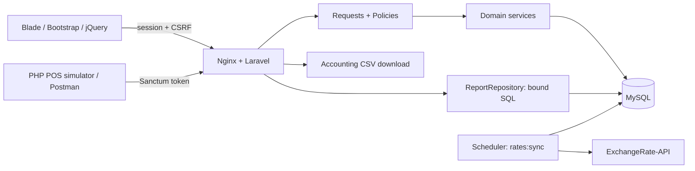

# Architecture and environment

## Stack decision

Use PHP 8.3 + Laravel 13, MySQL 8.4, Blade + Bootstrap 5 + jQuery through Vite. Use Fortify's authentication backend with custom Bootstrap views and Sanctum tokens for API clients. Laravel's official [release policy](https://laravel.com/docs/13.x/releases) confirms PHP 8.3 support; [Fortify](https://laravel.com/docs/13.x/fortify) supports application-owned authentication views.

Select compatible stable dependency versions during M00, record the versions and commit lockfiles. Do not install floating major versions during routine startup. PHPUnit is the default test runner; Pint checks style; Larastan checks application types. Use `brick/math` for explicit decimal calculations; verify its current API when implementing. No Redis is needed for the MVP: database cache/session stores suffice, and rate synchronization is a scheduled command.

## Components



The POS is a separate PHP CLI program with its own Composer manifest under `tools/pos-simulator`. It uses HTTP only and cannot reach application internals or the database. The exchange-rate provider sits behind `ExchangeRateProvider`, so tests use controlled fakes. A `ReportRepository` is justified by deliberate reporting SQL; avoid creating a generic repository around every Eloquent model.

## Expected application layout

```text
app/
  Contracts/ExchangeRateProvider.php
  Enums/                         # role, status, fuel type
  Http/Controllers/{Web,Api/V1}/
  Http/Requests/                 # per operation; explicit allowed fields
  Http/Resources/
  Models/
  Policies/
  Repositories/ReportRepository.php
  Services/
    FuelTransactionService.php
    FuelCardService.php
    PriceResolver.php
    ExchangeRateService.php
    OpenErApiProvider.php
    DeliveryOrderService.php
    AuditService.php
  Support/                       # decimal calculation, month boundaries
database/{migrations,factories,seeders}/
resources/{views,js,css}/
routes/{web.php,api.php,console.php}
tests/{Unit,Feature,Integration}/
tools/pos-simulator/
docker/                          # PHP, nginx, MySQL init / scheduler config
docs/                            # preserve this kit
prompts/                         # preserve this kit
postman/
compose.yaml
Makefile
```

Use Laravel 13's actual generated structure. Do not recreate older framework files such as an HTTP Kernel merely because a tutorial mentions them. Register middleware/exception rendering using the current skeleton conventions. API resources format success data; shared exception rendering makes API errors consistent.

## Docker development topology

M00 creates these services:

| Service | Purpose |
| --- | --- |
| `app` | PHP 8.3 FPM with Composer 2 and required extensions; working directory `/var/www/html` |
| `web` | Nginx, local URL `http://localhost:8080`, document root `public/` |
| `mysql` | MySQL 8.4, named persistent volume, health check; no public host port required |
| `node` | Compatible Node build container, run on demand for assets |
| `scheduler` | Same app image, `php artisan schedule:work` for development; start after setup |
| `mailpit` | Optional local email inspection; login does not depend on email delivery |

Use explicit image major/minor tags and record tested image versions. Supply PDO MySQL, mbstring, intl, zip and other framework/package requirements; discover omissions with Composer platform checks. Handle Linux UID/GID and writable `storage`/`bootstrap/cache` without world-writable permissions. Do not run a PHP development server as the production server.

### Bootstrapping a nonempty repository

`composer create-project` at `.` will fail because this handoff already exists. Build a staging Laravel project in a unique temporary directory. Inspect its contents; copy application files into the repository root, preserving `CLAUDE.md`, `START_HERE.md`, `docs/`, `prompts/`, `postman/`, `scripts/`, and `.github/`. Merge `.gitignore` and README instead of replacing them. Never copy a generated `.git` directory. Clean up only the staging directory that this operation created.

The Composer container must run on the chosen PHP version with matching extensions. Do not use `--ignore-platform-reqs` to make dependencies resolve. Host Composer installation is unnecessary. Create a project-local Dockerfile/tooling container first if needed, then run Composer inside it.

## Command contract to implement in M00

| Command | Required behavior |
| --- | --- |
| `make setup` | Build images; copy example env only if absent; install locked dependencies; create key only if absent; start DB and wait for health; migrate; seed only an empty local demo; build assets; start web/app/scheduler |
| `make up` | Start existing local stack, preserving state |
| `make down` | Stop stack without deleting volumes |
| `make test` | Run tests against isolated `fleetfuel_test` MySQL database, then the JavaScript unit tests (`npm test`) |
| `make lint` | Run Pint in check mode |
| `make analyse` | Run Larastan at an initially practical level, default 6; no blanket ignore baseline |
| `make build` | Install locked frontend dependencies and compile production assets |
| `make verify` | Run lint, static analysis, tests and build, fail if any fails |
| `make logs` | Show useful service logs without dumping env/secrets |
| `make simulate` | Added in M06: run the standalone POS simulator against the running stack; credentials only from `POS_*` environment variables |

MySQL init must provision separate dev/test databases and grants without using root from the app. Tests must refuse a non-testing environment/database. Test reset operations may target only the dedicated test DB. Repeated setup must preserve APP_KEY, demo records and credentials. An explicit reset command, if added, must be clearly named, guarded and separate from setup.

The host needs Make to expose this command interface; M00 checks it with Docker/Git. If Make is unavailable, provide equivalent documented Compose commands while resolving that prerequisite rather than leaving setup instructions unusable.

## Environment configuration

M00 generates a real `.env.example` matching its Compose service names. Include the following categories; never copy real credentials into documentation:

| Setting | Local default / rule |
| --- | --- |
| `APP_NAME`, `APP_ENV`, `APP_URL`, `APP_DEBUG`, `APP_KEY` | FleetFuel Portal, local, localhost:8080, true, generated key |
| Application timezone | UTC for persistence; `BUSINESS_TIMEZONE=Asia/Beirut` for display/quotas |
| `DB_CONNECTION`, `DB_HOST`, `DB_PORT`, `DB_DATABASE` | mysql, mysql, 3306, fleetfuel |
| `DB_USERNAME`, `DB_PASSWORD` | Project-local development user and generated/local credential |
| Session / cache | database stores, tables migrated |
| `EXCHANGE_RATE_MODE` | `fixture` locally; `live` for integration demonstration |
| FX endpoint | Fixed server configuration `https://open.er-api.com/v6/latest/USD`; never user input |
| FX age / ingestion age | 72 hours each; central tested configuration |
| `DEMO_MODE`, `DEMO_PASSWORD` | local demo enabled; local password only, hashed when seeded |

Use `.env.testing.example` for the separate test database. Keep real `.env.testing` ignored. Test time is frozen in each date-sensitive test, not inherited from a machine's current date.

## Error and operations design

Log request/correlation IDs and safe error codes. Domain errors become documented HTTP responses; unexpected faults become generic 500 responses with details in server logs only. Health checks should distinguish application liveness from DB readiness. Rate sync records last attempt, last success and safe failure reason; health panels expose these only to admin. Do not make page loads depend on outbound HTTP.

Deployment choices and actual cost depend on the user's account and current offerings. Prepare a portable production image and runbook; choose a hosting provider during M11 after checking current official documentation.
