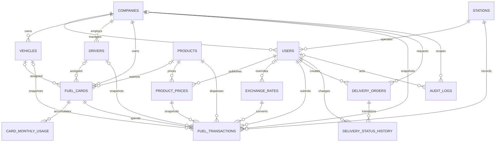

# Data model

This schema is implemented by the M01 migrations in `database/migrations/`. Use Laravel migrations and portable types. IDs are bigint primary keys; foreign keys use matching types. Times are UTC with second precision; API input must contain an offset. Unless stated otherwise, tables have `created_at` and `updated_at`; append-only tables (prices, rates, ledger, history, audit) have no `updated_at`.

## Relationships

Every line is a real foreign key; `tests/Feature/Database/ErDiagramTest.php` compares this diagram with MySQL's foreign keys. The parent entity is on the left. `integration_sync_states` has no relationships and is omitted.

Same-company rules are enforced by composite foreign keys, not only by validation: `fuel_cards (company_id, vehicle_id)` and `(company_id, driver_id)` must match `vehicles`/`drivers (company_id, id)`, and `fuel_transactions (company_id, fuel_card_id | vehicle_id | driver_id)` must match the card, vehicle and driver of that company. A composite key with a NULL part is not checked, so unassigned cards remain valid.

## Master data

| Table | Fields and constraints |
| --- | --- |
| `companies` | `name varchar(120)`, nullable `tax_no varchar(50)` unique if provided, `status varchar(20)` active/inactive |
| `stations` | `name varchar(120)`, `district varchar(80)`, `governorate varchar(80)`, nullable `latitude decimal(10,7)`, nullable `longitude decimal(10,7)`, `is_active boolean` |
| `users` | Laravel auth fields, unique `email`, `role varchar(30)`, nullable `company_id FK`, nullable `station_id FK`, `is_active boolean`; manager requires company only, operator station only, admin neither |
| `products` | unique `code varchar(20)` ULP95/ULP98/DIESEL, `name varchar(80)`, `fuel_type varchar(20)` petrol/diesel, `unit varchar(10)` L, `is_active boolean` |
| `vehicles` | `company_id FK`, unique `plate_no varchar(30)`, `fuel_type varchar(20)` petrol/diesel, `tank_capacity_l decimal(10,2)` positive, nullable `odometer_km bigint` nonnegative, `is_active boolean` |
| `drivers` | `company_id FK`, `name varchar(120)`, nullable `phone varchar(30)`, `license_no varchar(50)`, `is_active boolean`; unique `(company_id, license_no)` |
| `fuel_cards` | `company_id FK`, nullable `vehicle_id FK`, nullable `driver_id FK`, unique `card_no varchar(40)`, nullable `allowed_product_id FK`, nullable `monthly_limit_l decimal(12,2)`, nullable `monthly_limit_usd decimal(18,2)`, `status varchar(20)` active/blocked/archived |

Use application validation and compatible DB checks for positive values/role ownership. Do not use native database ENUMs. Validate same-company card/vehicle/driver relationships on writes, including attempts using other tenants' IDs. Treat company ownership fields as immutable after creation. A card's vehicle, driver and product restriction may change only before its first accepted transaction; quotas and active/blocked status remain editable. Archive is terminal. Do not hard-delete master rows referenced by transactions/audit/history. Products, stations, drivers and vehicles use `is_active`; companies use status.

Both quota fields may be null (unlimited); zero means no further spend in that dimension. Vehicle fuel type restricts products even when card allowed_product is null. A card without vehicle may still have a driver and product restriction.

## Pricing and exchange observations

`product_prices`:

- `product_id FK`, `price_lbp decimal(18,4)` positive, `effective_from timestamp/datetime`, `created_by FK users`.
- Unique `(product_id, effective_from)`; index supports latest price at or before event time.
- Immutable once created. No independently editable USD price. API/UI calculate an indicative USD price from the eligible rate, while accepted transactions store amounts.
- New admin prices must be effective now or later; seeders may insert historical fixtures. Corrections create a new effective price. Published historical records are never updated/deleted.

`exchange_rates`:

- `base char(3)` USD, `quote char(3)` LBP, `rate decimal(20,8)` positive, `source varchar(20)` provider/manual/fixture.
- `effective_at` (provider observation time, or override activation), `fetched_at` nullable, `expires_at` (effective +72h for provider/fixture; <=72h for manual).
- `created_by FK users` nullable for automated observations; `reason varchar(255)` required for overrides.
- Unique `(base, quote, source, effective_at)`; index `(base, quote, effective_at)`.
- Immutable: repeated fetch of same observation is a no-op. If the provider sends conflicting data for an existing timestamp, log the discrepancy and preserve the accepted observation.
- No bulk public rate endpoint. Provider errors are operational events, not valid rate rows.

Source research's one row per date is insufficient for explicit intraday overrides. Effective instants plus expiry remove that ambiguity. Record sync status in a small `integration_sync_states` table (`name` unique, `last_attempt_at`, `last_success_at`, safe `last_error_code`) or an equivalently durable database-backed store; this is operational metadata, not financial history.

## Ledger and monthly usage

`card_monthly_usage`:

- `fuel_card_id FK`, `month_start date` (first local Beirut calendar day), `used_l decimal(14,2)` default 0, `used_usd decimal(20,2)` default 0.
- Unique `(fuel_card_id, month_start)`. Use explicit model `$table` if Eloquent's inferred plural differs.
- Updated only inside the same DB transaction as an accepted fuel transaction. Acquire the parent card lock before creating or updating the row.
- Add a read-only reconciliation command in M05 that compares counters to the ledger. It reports differences and exits nonzero; it must not silently repair data.

`fuel_transactions` (append-only):

| Group | Fields |
| --- | --- |
| Identity | `fuel_card_id FK`, `station_id FK`, `external_ref varchar(100)`, `request_hash char(64)` |
| Ownership snapshots | `company_id FK`, nullable `vehicle_id FK`, nullable `driver_id FK`, nullable `tank_capacity_l decimal(10,2)` |
| Fuel | `product_id FK`, `liters decimal(10,2)`, nullable `odometer_km bigint` |
| Price snapshot | `product_price_id FK`, `unit_price_lbp decimal(18,4)`, `amount_lbp decimal(20,2)` |
| FX snapshot | `exchange_rate_id FK`, `rate_lbp_per_usd decimal(20,8)`, `rate_source varchar(20)`, `rate_effective_at`, `amount_usd decimal(18,2)` |
| Timing | `transacted_at`, `quota_month date`, `created_at` (received time) |
| Actor | `created_by FK users` |

Unique `(station_id, external_ref)`. Index `(fuel_card_id, transacted_at, id)`, `(company_id, transacted_at, id)`, `(station_id, transacted_at, id)` and `(vehicle_id, transacted_at, id)`. Use `quota_month` for reconciliation; use UTC half-open ranges for date-filtered reports. Add product/time indexes only when query plans justify them.

Card references and external refs are uppercase ASCII. Validate then canonicalize; use the normalized value for storage/hash. This avoids MySQL versus SQL Server collation differences changing idempotency. Card numbers are identifiers in this demo, not payment credentials; do not expose full numbers unnecessarily in logs or dashboards.

## Deliveries and audit

`delivery_orders`: `company_id FK`, `created_by FK users`, `address varchar(500)`, `governorate varchar(80)`, `liters decimal(10,2)`, `preferred_start_at`, `preferred_end_at`, nullable `scheduled_start_at`/`scheduled_end_at`, `status varchar(30)`, nullable `assigned_truck varchar(60)`, nullable `delivered_at`, nullable `cancel_reason varchar(255)`. Index `(company_id, created_at)` and `(status, preferred_start_at)`.

`delivery_status_history`: `delivery_order_id FK`, nullable `from_status`, `to_status varchar(30)`, `changed_by FK users`, nullable `note varchar(255)`, `changed_at`; index `(delivery_order_id, changed_at, id)`. Initial row is null→pending. Rows are immutable.

`audit_logs`: nullable `user_id FK`, `action varchar(80)`, `auditable_type varchar(80)` (stable model alias, not arbitrary class input), `auditable_id bigint`, nullable `company_id FK`, nullable `old_values JSON`, nullable `new_values JSON`, nullable `request_id varchar(64)`, `created_at` only. Index `(auditable_type, auditable_id, created_at)` and `(company_id, created_at)`.

Audit explicitly selected business fields only. Never serialize passwords, tokens, provider headers or whole requests. Keep audit and sensitive write in the same transaction. No application update/delete interface for audit/history tables.

Laravel infrastructure tables (sessions, cache, cache locks, password reset tokens if used, Sanctum personal access tokens) are additional; do not claim a fixed table count from the research.

## Seed strategy

Factories generate fictional records with internally valid ownership. `DemoSeeder` is explicit and local/test guarded; production never seeds it automatically. Reference products can have a separate safe seeder. Read `docs/06-UI-SPEC.md` and `docs/examples/fixtures.json` for scenarios.

Date-sensitive seed data is relative to a documented `--as-of` clock, defaults to current time, and has matching synthetic historic prices/rates. Fixed-time test fixtures freeze the clock. Populate ledger and counters consistently through the service or an explicit fixture builder whose reconciliation is tested. Demo setup must not duplicate transactions on repeat execution.
