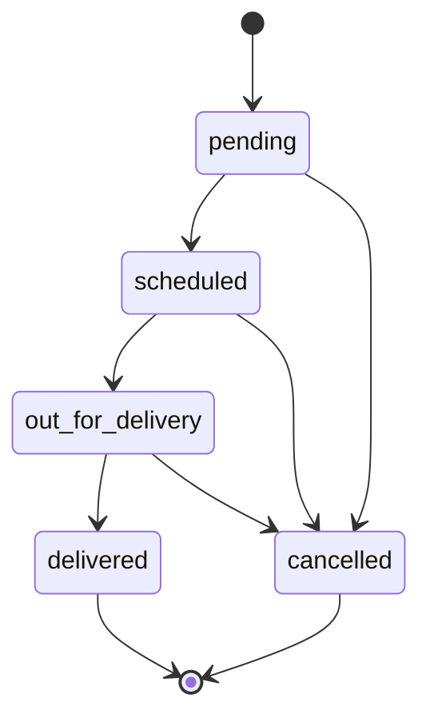

# Business rules and algorithms

These rules are the single source of truth for the services and tests. Treat money, ownership and retry behavior as contracts rather than UI details.

## Decimal arithmetic

Accept liters and monetary input as plain decimal strings with documented scale, never JSON floating-point numbers. Reject negative values, exponent notation, commas and excess decimal places. Normalize input `"20"` to `"20.00"`; calculations use `brick/math` BigDecimal with explicit rounding. Persist database DECIMAL values and serialize decimal strings.

For each purchase:

```text
amount_lbp = round_half_up(liters × unit_price_lbp, 2)
amount_usd = round_half_up(amount_lbp ÷ rate_lbp_per_usd, 2)
```

Compare quotas to the rounded amount_usd that will be stored. Do not compute total USD from a rounded per-liter USD display price. Example synthetic rate 89500.00000000, price 80000.0000 LBP/L and volume 20.00 L yield 1600000.00 LBP and 17.88 USD. A 17.88 USD remaining quota permits it exactly; 17.87 rejects it. The numeric rate is a fictional test constant, not a live market-rate statement.

Validate storage bounds for both inputs and calculated outputs before inserting. A product of individually valid values can overflow an amount column; return 422 validation_failed without changing the ledger/counter. Normalize incoming provider numeric rates deliberately to the documented eight-decimal precision before constructing domain values; do not allow PHP float arithmetic to enter pricing or quota calculations.

## Time and historical resolution

- Store UTC. Parse API timestamps with an explicit `Z` or UTC offset; reject timezone-free values, impossible dates and subsecond input for the MVP.
- Ingestion permits `now - 72h <= transacted_at <= now`. Replays are not rejected just because the originally accepted event is now older than 72h.
- Determine quota month from `transacted_at` converted to `Asia/Beirut`, then use the first local calendar day as `quota_month`. Do not use server UTC month or received month.
- For month-range queries, construct local month boundaries then convert each independently to UTC. Do not assume a fixed UTC+2/+3 offset or 30-day month.
- Report `from`/`to` are local date strings: `from` inclusive midnight, `to` exclusive midnight. UI labels make the exclusive end explicit or convert an inclusive date-picker end by adding one local day.
- Choose latest product price with `effective_from <= transacted_at`. No eligible price yields `price_unavailable` (422).

## FX synchronization and overrides

`rates:sync` uses the Laravel HTTP client to fetch the fixed USD endpoint with a short connection timeout and total timeout, up to three total attempts with bounded backoff for transient transport errors/5xx. A provider 429 records retry advice and ends that run without an immediate retry loop. Parse result success, base USD, positive finite LBP decimal within schema bounds and sane provider timestamps before saving.

Preserve the provider observation instant from its response; do not label fetch time as a new observation. Store once per observation. Schedule one daily UTC run with overlap prevention; make a manual command available. Use the provider's next-update hint/cache to prevent repeated same-day downloads. Tests fake all outbound calls and assert the attempted count and timeouts. See the provider's [open endpoint documentation](https://www.exchangerate-api.com/docs/free).

In explicit fixture mode, `rates:sync` makes no HTTP request: append one clearly labeled synthetic observation per UTC day using the configured fixture constant. This keeps a running local demo usable after its initial seed rates expire. Existing fixture observations remain unchanged; production live mode never silently switches to fixtures. Provide at least the preceding 72 hours of fixture observations when initially seeding so the bounded ingestion window is demonstrable.

At event time T, eligible rates satisfy effective_at <= T < expires_at. In live mode exclude fixture rates. Prefer an eligible manual override with the latest effective_at; otherwise the latest eligible provider observation. In fixture mode use explicit fixture observations (and valid manual overrides). A manual override must have positive rate, reason, effective_at >= creation time and expiry no later than effective_at +72h; it is immutable and audited. Do not create retroactive overrides.

An outage leaves existing observations untouched. If an eligible rate exists, new ingestion continues using it; the admin UI reports sync degradation. If none exists, return `rate_unavailable` (503) and do not change usage. Historical purchases/report totals remain readable from their snapshots regardless of provider availability. A historical price-preview request also requires an eligible historical rate; a latest-only API cannot invent that history.

Show rate source/time on transaction detail. For presentation, an admin may see sync freshness, expiry and current override, but do not publish the full raw provider feed. Rate-based pages include provider attribution when using its data.

## POS request, idempotency and quota algorithm

1. Require authenticated, active station operator with active station and a real Sanctum token with `transactions:create`; session cookies alone do not authorize POS ingestion. Apply a per-user/station limiter. Derive station_id from the account, never the payload.
2. Perform structural validation first (allowed keys, types, timestamp format, positive volume, ref/card formats). Normalize keys/decimal strings/timestamp to a canonical form. Hash station_id, external_ref, card_no, product_code, liters, transacted_at UTC and nullable odometer. JSON key order or omitted/null odometer must not change the hash.
3. Look up `(station_id, external_ref)`. Equal hash returns the original resource, status 200, `Idempotency-Replayed: true`; unequal hash returns 409 `idempotency_conflict`. Do this before checking age, mutable quotas, price or card status. An expired/revoked token still fails authentication first.
4. For a new key, start a database transaction. Lock the referenced fuel_card row with `FOR UPDATE`. Recheck idempotency inside the transaction using a current/locking read. Card-scoped locks serialize all stations spending on the same card.
5. Check allowed time window, active company/card/assigned vehicle/assigned driver/product; product matches both card restriction and vehicle fuel type. Unknown card is 404 `not_found`; blocked/inactive/archived conditions and disallowed product are 403 business declines. Oversized tank fills are accepted but reported as anomalies; quotas still apply.
6. Resolve price and rate for the event instant and calculate rounded amounts. No external HTTP inside the DB transaction. Resolve quota month. Get/create the corresponding usage row while holding the card lock, then lock it. Maintain consistent lock order: card → monthly usage → insert ledger. Each operation handles one card only.
7. Check non-null liter and USD limits with `used + requested <= limit`; either failure returns 403 `quota_exceeded` and rolls back. A zero limit rejects any positive spend; null is unlimited. Current limits apply to newly arriving events even when event time falls in the prior month.
8. Insert immutable transaction with snapshots, canonical hash and unique station/ref key. Increment monthly usage exactly once. Commit. Return 201 and resource location; new replays do not increment anything.
9. The unique index is the final arbiter of concurrent same-ref requests. If it rejects a racing insert (including a different card sharing the key), roll back the failed transaction and load the winner in a fresh transaction/read. Equal canonical hash returns 200, unequal 409. Do not catch and continue queries in a failed SQL Server transaction. If winner is temporarily unavailable, use a bounded retry; on exhausted contention return documented 503 `temporarily_unavailable`.

Use bounded deadlock retries around the whole DB transaction, with no emails/HTTP/nontransactional side effects inside the retry closure. Verify exception mapping for the actual database driver. An early idempotency lookup alone is insufficient; an application `exists()` check is not a substitute for a unique constraint.

Quota edits and card status/assignment edits acquire the same card lock. A change lowering the current limit below consumed totals is allowed after an explicit UI warning, audited and reflected as over-quota. It does not invalidate prior transactions. Balance returns max(0, limit-used), or null for an unlimited dimension; include an over_quota boolean. The report shows current-month quota exceptions due to reductions, not fictitious accepted overspending. Past months are usage reports, not historical-limit compliance claims.

Card company ownership is never reassigned. Vehicle/driver/product restriction cannot change after first use in MVP. Product/price/rate updates do not rewrite existing transactions. Company/station deactivation may overlap an already running authorized transaction; it blocks subsequent requests, and disabling credentials revokes tokens. Card blocking is strictly serialized with ingestion through the shared lock.

No accepted-ledger update/delete endpoint. A balance response is informational, not a reservation; only POST ingestion atomically checks and consumes quota.

## Reports and anomalies

- Consumption groups by company, vehicle or product IDs with labels. Sum stored liters/amounts; do not join mutable card assignments to determine historical owner.
- Top stations aggregate accepted transactions, sorted by liters descending then station ID for stable ties, maximum 10.
- Quota exceptions use current-month counter and present-day limits; include blocked cards and explain reason.
- Tank anomaly: accepted liters > snapshotted tank capacity. Missing vehicle/capacity yields no tank comparison.
- Rapid-fill anomaly: same vehicle has a prior accepted purchase less than 30 minutes earlier. Order by `(transacted_at, id)` to break ties. Check the predecessor before the requested report start so the first visible row can be flagged. A distinct fill at the same second qualifies; a replay is not a new row. Card-only transactions have no vehicle rapid-fill flag.
- Efficiency is labeled an estimate: `(current_odometer - previous_odometer) / current_liters`, only with increasing present readings and an explicit full-to-full assumption. Missing/decreasing readings yield null, never invented efficiency. Do not use current vehicle odometer to rewrite transaction data.
- Delivery SLA: hours from initial pending history time to delivered history time; canceled/pending orders excluded. Filter the report by delivered time and group by governorate. Use driver-specific SQL for timestamp differences if needed.
- All queries apply tenant scope, bind values and allowlist group/sort fields. Filtered totals cover the whole filtered set, independently of pagination. Use deterministic sort keys.

## Delivery state machine



An active company manager or admin creates an order with positive liters, address, governorate and future preferred start/end (end > start). Fuel is always DIESEL. No card purchase or accounting debit is created.

Only admin can advance statuses, select a scheduled window and truck. Scheduling requires a future valid scheduled window plus assigned_truck. Dispatch requires scheduling details already present. Delivery sets delivered_at once using server time. Cancellation requires a reason; manager can only cancel their own pending order. Terminal states cannot transition or be edited. Every mutation sends expected_status; a mismatch returns 409 `stale_state`. Same target status is a 409 invalid transition, not a duplicate history row.

Lock order row, authorize and validate current state inside one DB transaction, update it and append history and audit atomically. Do not rely on hidden buttons for authorization. Concurrent status requests with the same expected state can result in only one success. Manager cancellation uses the same service as the admin screen/API.

## Security and audit

Use tenant-scoped lookups that return 404 for another company's resource. Own-role prohibitions return 403. Form Request rules reject attempts to supply company_id/station_id/role where the caller cannot control them. Browser mutations require CSRF; bearer API requests are stateless. Token abilities are necessary but never sufficient: combine with role, ownership and active-account checks. Tokens expire after 24 hours by project policy; never let a client request arbitrary abilities/role.

Audit card quota/status changes, company/station deactivation, published prices, FX overrides and delivery transitions. Ordinary failed logins/POS declines go to redacted security/operational logs, not a pretend financial ledger. Export CSV escapes spreadsheet-formula prefixes (`=`, `+`, `-`, `@`, leading tabs/newlines after whitespace) and applies tenant filtering before streaming.
